# Engenharia reversa do painel UP VW para usar o Can bus


# 1. Introdução

Este texto elaborei para apresentar o passo a passo da engenharia reversa do painel de instrumentos do UP da VW.

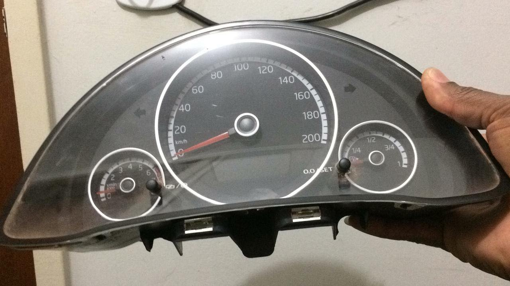

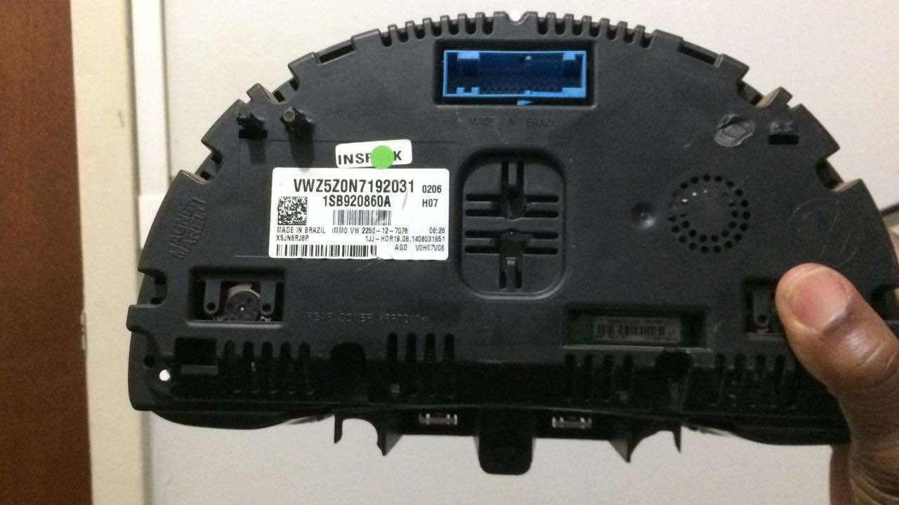

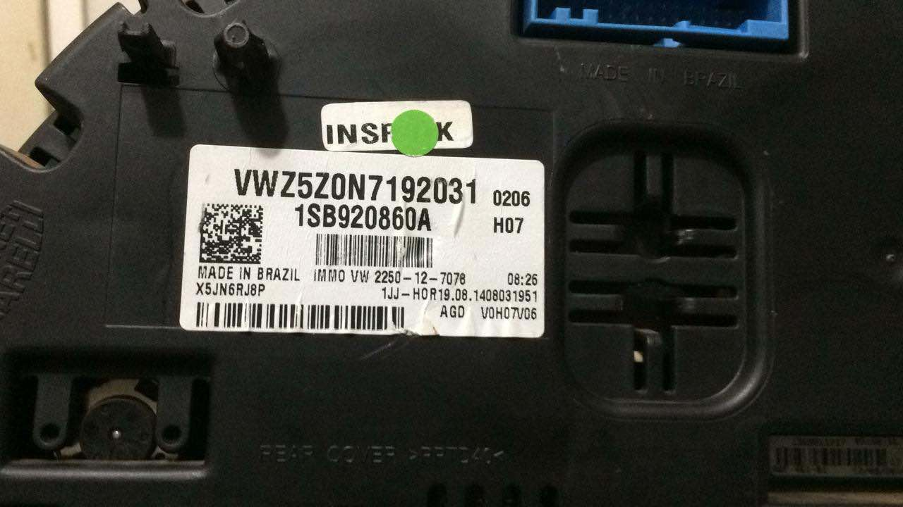

O primeiro passo foi buscar identificar os pinos de alimentação e terra do painel. 
A partir de um video sobre manutenção de paneis de instrumentos no youtube conseguimos descobrir que  pino 20 é GND e que os pinos 32 e 31 são de alimentação. Suspeito que o pino 32 deve ser alimentação geral e 31 deve ser alimentação do painel depois da chave de partida.


Bom...  com isso resolvido, podemos ver se a gente acha um conector que se encaixa nessas configuração..   Deve ter alguma documentação sobre reparação de paineis ou instalação do imobilização do motor (immo) e sua chave de segurança que trata sobre este conector.  Também deve ter alguma padronização de conectores e pinagem pelo fabricante baseado nas cores (conector azul, verde, etc.)

Eu não tinha certeza se este painel de instrumentos tinha uma interface CAN. 
Para tirar essa dúvida a gente desmontou o painel e fizemos uma análise dos componentes na placa de circuito impresso. 
Localizado o microcontrolador na placa de circuito impresso, pesquisou-se o datasheet seu e conferi que o chip tem duas interfaces can.

[https://www.nxp.com/docs/en/data-sheet/MC9S12XHZ512.pdf](https://www.nxp.com/docs/en/data-sheet/MC9S12XHZ512.pdf)

Continuando com a engenharia reversa.
Pela lógica o microcontrolador deve estar ligado a um transciever,  e este chip deve ser um CI mais robusto pelo fato de estar diretamente ligado ao barramento CAN.
Também, pela lógica, este chip deve estar posicionado entre o microcontrolador e o conector.


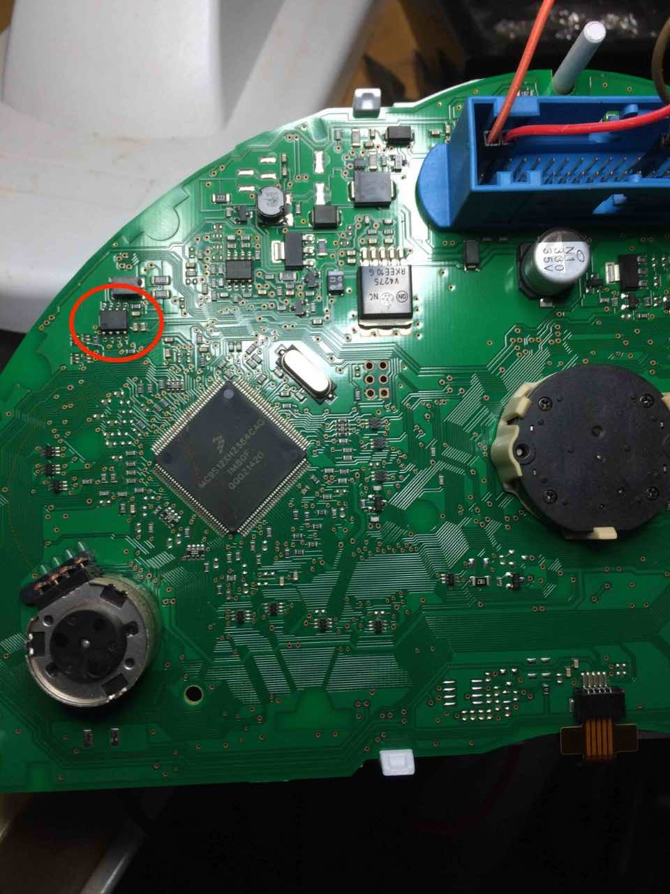

Achei o chip !

[https://www.infineon.com/cms/en/product/transceivers/automotive-transceiver/automotive-can-transceivers/tle6251ds/](https://www.infineon.com/cms/en/product/transceivers/automotive-transceiver/automotive-can-transceivers/tle6251ds/)

Com o multimetro deu para descobrir a ligação dos pinos do transciever com o conector.


| pino | função   |    
|:----:|:--------:| 
| 28   | CAN_H    | 
| 29   | CAN_L    | 
| 20   | GND      |
| 32   | +12v     |
| 31   | +12v     |


Com essa informação podemos rodar um teste, alimentando o painel e medir com o osciloscopio o sinal que o microcontrolador manda no barramento CAN.
Pela lógica o painel deve mandar uma informação no barramento avisando que ele está vivo e esperando dados e dessa forma podemos analisar o sinal e tentar medir o baudrate e visualizar o formato dos pacotes de dados que trafegam no barramento.

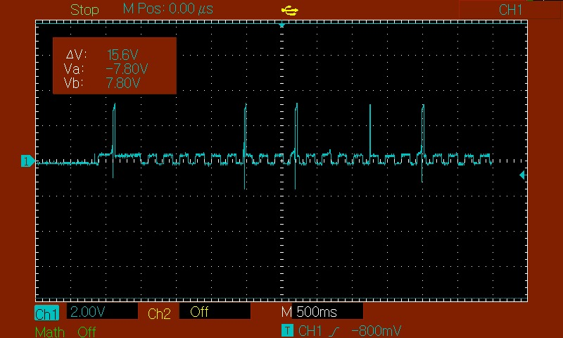

A tela a cima mostra o sinal medido diretamente na saída dos pinos 28 e 29 (CAN\_H e CAN\_L). Convem mencionar que não colocamos nenhum resistor de terminação no barramento. 

Com a colocação de um resistor de terminação (pode ser de 120 - 470 Ohms) o sinal ficou mais nítido e dá para ver claramente que quando o painel é ligada à fonte a primeira coisa que aparece no barramento é uma palavra com um comprimento de 300ms. Depois de esperar 100ms o painel manda um bloco de informação de 130ms e repete isso ciclo.

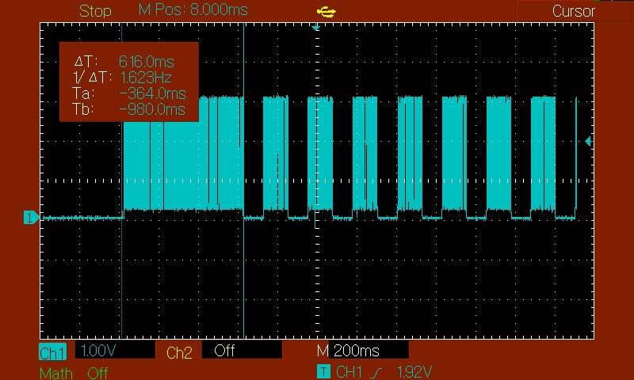

A próxima tela mostra o detalhe deste bloco de 130ms.

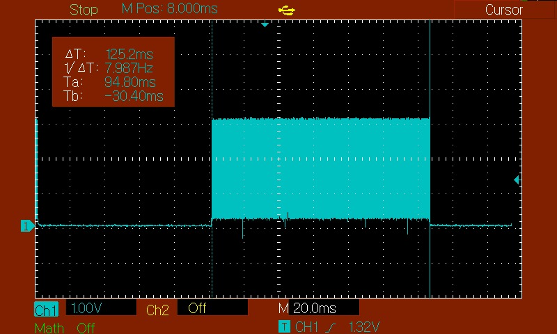

Este bloco de 130ms é divido em vários blocos com 200uS

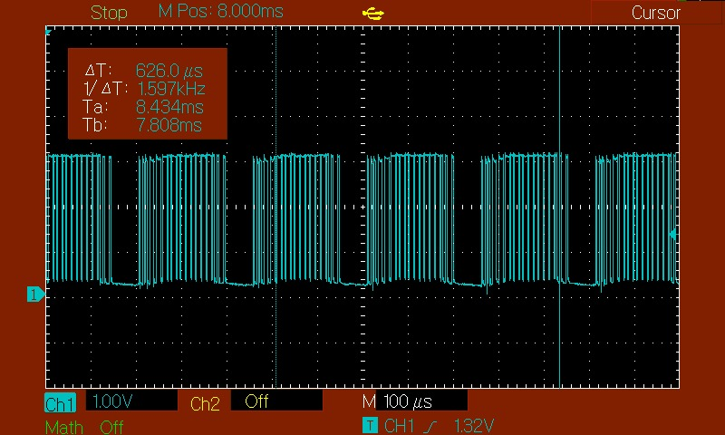

Este bloco deve ser a pacote CAN e deve ser possível identificar o baudrate a partir da sua análise.

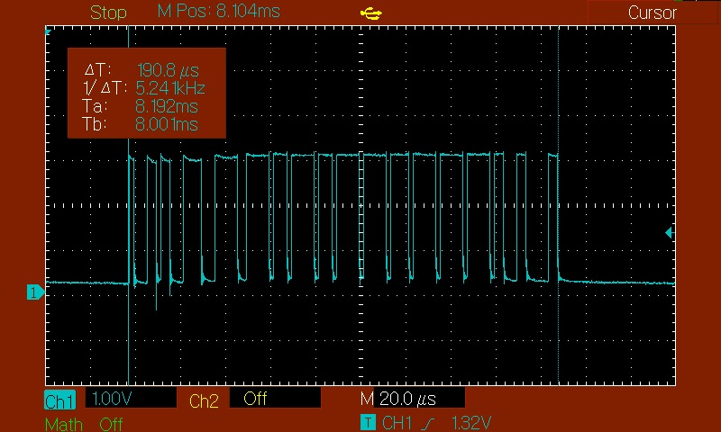

No detal dá para ver que o menor elemento tem deste bloco tem 2us. Ou seja, a taxa de transmissao é 500khz.

Os mais corajosos podem a partir deste sinal tentar  decodificar o dado no barramento CAN.
Outra solução é liga-lo o painel a um microcontrolador ou microcomputador com interface CAN e depurar o codigo.


# 2. Dump do CAN pela porta serial

Usando a biblioteca do CAN Read Demo do Sparkfun CAN bus shield conseguimos monitorar o barramento. 
Um programa simples que monitora e imprime os dados pode ser obtido no link [https://github.com/sparkfun/SparkFun\_CAN-Bus_Arduino_Library](https://github.com/sparkfun/SparkFun_CAN-Bus_Arduino_Library). 

A foto mostra a montagem do microcontrolador, módulo e painel.
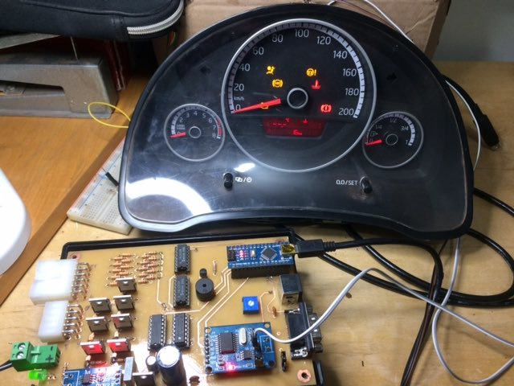

O programa exemplo `CAN_Read_Demo` foi usado para mostrar os dados no barramento usando um Arduino Nano e um módulo [CAN BUS MCP2515](https://www.filipeflop.com/produto/modulo-can-bus-mcp2515-tja1050/) 

```
#include <Canbus.h>
#include <defaults.h>
#include <global.h>
#include <mcp2515.h>
#include <mcp2515_defs.h>


void setup()
{
 Serial.begin(9600); 
 Serial.println("CAN Read - Testing receival of CAN Bus message");  
 delay(500);  
 if(Canbus.init(CANSPEED_500))  //Initialise MCP2515 CAN controller at the specified speed
    Serial.println("CAN Init ok");
 else
    Serial.println("Can't init CAN");
}

void loop() {
 tCAN message;
 if (mcp2515_check_message()) 
  {
    if (mcp2515_get_message(&message)) 
    {
               Serial.print("ID: ");
               Serial.print(message.id,HEX);
               Serial.print(", ");
               Serial.print("Data: ");
               Serial.print(message.header.length,DEC);
               for(int i=0;i<message.header.length;i++) 
                { 
                  Serial.print(message.data[i],HEX);
                  Serial.print(" ");
                }
               Serial.println("");
     }
   }
 }   

```


Este programa gera o seguinte dump na porta serial no momento que o painel é ligado.


```
02:41:19.961 -> ID: 322, Data: 0
02:41:20.032 -> ID: 322, Data: 0
02:41:23.771 -> ID: 321, Data: 926 26 92 64 97 48 90 FF C 
02:41:23.843 -> ID: 321, Data: 926 26 92 64 97 48 90 FF C 
02:41:23.916 -> ID: 321, Data: 964 97 4F 92 64 97 4F 92 C 
02:41:23.988 -> ID: 321, Data: 964 97 4F 92 64 97 4F 92 C 
02:41:24.023 -> ID: 321, Data: 997 4F 92 64 97 4F 92 64 C 
02:41:24.096 -> ID: 321, Data: 964 97 4F 92 64 97 4F 92 C 
02:41:24.165 -> ID: 321, Data: 964 97 4F 92 64 97 4F 92 C 
02:41:24.236 -> ID: 321, Data: 964 97 4F 97 4F 92 24 92 C 
02:41:24.307 -> ID: 321, Data: 94F 92 64 97 4F 92 64 97 C 
02:41:24.380 -> ID: 320, Data: 964 97 4F 92 64 97 4F 92 C 
02:41:24.516 -> ID: 321, Data: 992 20 92 64 97 4F C9 4F C 
02:41:24.588 -> ID: 321, Data: 9C9 C9 8 C9 C9 C9 C9 C9 C 
02:41:24.728 -> ID: 322, Data: 9C9 C9 C9 C8 C9 C9 C9 C9 C 
02:41:24.798 -> ID: 322, Data: 0
02:41:24.870 -> ID: 322, Data: 0
02:41:24.938 -> ID: 322, Data: 0
02:41:25.007 -> ID: 322, Data: 0
02:41:25.080 -> ID: 322, Data: 0
02:41:25.191 -> ID: 322, Data: 0
02:41:25.259 -> ID: 322, Data: 0
02:41:25.398 -> ID: 322, Data: 0
02:41:25.465 -> ID: 322, Data: 0
02:41:25.542 -> ID: 322, Data: 0
02:41:25.609 -> ID: 322, Data: 0
02:41:25.676 -> ID: 322, Data: 0
02:41:25.748 -> ID: 322, Data: 0
02:41:25.820 -> ID: 322, Data: 0
02:41:25.892 -> ID: 322, Data: 0
02:41:25.964 -> ID: 322, Data: 0
02:41:26.103 -> ID: 322, Data: 0
02:41:26.137 -> ID: 322, Data: 0
02:41:26.213 -> ID: 322, Data: 0
02:41:26.287 -> ID: 322, Data: 0
02:41:26.355 -> ID: 322, Data: 0
02:41:26.428 -> ID: 322, Data: 0
02:41:26.501 -> ID: 322, Data: 0
02:41:26.568 -> ID: 322, Data: 0
02:41:26.636 -> ID: 322, Data: 0
02:41:26.779 -> ID: 448, Data: 10C9 C9 C9 C8 C9 C9 C9 C9 C 0 
02:41:26.854 -> ID: 322, Data: 0
02:41:26.993 -> ID: 322, Data: 9C9 C9 C9 C8 C9 C9 C9 C9 C 
02:41:27.066 -> ID: 322, Data: 9C9 C9 C9 C8 C9 C9 C9 C9 C 
02:41:27.139 -> ID: 322, Data: 9C9 C9 C9 C8 C9 C9 C9 C9 C 
02:41:27.211 -> ID: 322, Data: 9C9 C9 C9 C8 C9 C9 C9 C9 C 
02:41:27.244 -> ID: 322, Data: 9C9 C9 C9 C8 C9 C9 C9 C9 C 
02:41:27.314 -> ID: 322, Data: 9C9 C9 C9 C8 C9 C9 C9 C9 C 
02:41:27.384 -> ID: 322, Data: 9C9 C9 C9 C8 C9 C9 C9 C9 C 
02:41:27.451 -> ID: 322, Data: 0
02:41:27.522 -> ID: 322, Data: 0
02:41:27.663 -> ID: 322, Data: 0
02:41:27.736 -> ID: 122, Data: 0
02:41:27.807 -> ID: 322, Data: 0
02:41:27.875 -> ID: 322, Data: 0
02:41:27.942 -> ID: 322, Data: 0
02:41:28.015 -> ID: 322, Data: 0
02:41:28.086 -> ID: 764, Data: 0
02:41:28.154 -> ID: 322, Data: 0
02:41:28.226 -> ID: 322, Data: 0
02:41:28.332 -> ID: 322, Data: 0
02:41:28.399 -> ID: 322, Data: 0
02:41:28.538 -> ID: 322, Data: 0
02:41:28.610 -> ID: 64, Data: 0
02:41:28.687 -> ID: 322, Data: 0
02:41:28.758 -> ID: 322, Data: 0
02:41:28.825 -> ID: 322, Data: 0
02:41:28.900 -> ID: 322, Data: 0
02:41:28.973 -> ID: 322, Data: 0
02:41:29.011 -> ID: 322, Data: 0
02:41:29.083 -> ID: 322, Data: 0
02:41:29.224 -> ID: 322, Data: 0
02:41:29.295 -> ID: 322, Data: 0
02:41:29.371 -> ID: 322, Data: 0
02:41:29.440 -> ID: 322, Data: 0
02:41:29.517 -> ID: 322, Data: 0
02:41:29.584 -> ID: 322, Data: 0
02:41:29.620 -> ID: 322, Data: 0
02:41:29.689 -> ID: 322, Data: 0
02:41:29.790 -> ID: 322, Data: 0
02:41:29.896 -> ID: 322, Data: 0
02:41:29.969 -> ID: 322, Data: 0
02:41:30.041 -> ID: 322, Data: 0
02:41:30.113 -> ID: 322, Data: 0
02:41:30.182 -> ID: 322, Data: 0
02:41:30.250 -> ID: 322, Data: 0
02:41:30.317 -> ID: 322, Data: 0
02:41:30.384 -> ID: 322, Data: 0
02:41:30.456 -> ID: 322, Data: 0
02:41:30.597 -> ID: 322, Data: 0
02:41:30.671 -> ID: 322, Data: 0
02:41:30.810 -> ID: C8, Data: 0
02:41:30.880 -> ID: 322, Data: 0
02:41:30.947 -> ID: 322, Data: 0
02:41:31.020 -> ID: 322, Data: 0
02:41:31.054 -> ID: 322, Data: 0
02:41:31.126 -> ID: 248, Data: 0
02:41:31.270 -> ID: 322, Data: 0
02:41:31.343 -> ID: 322, Data: 0
02:41:31.478 -> ID: 322, Data: 0
02:41:31.551 -> ID: 322, Data: 0
02:41:31.626 -> ID: 322, Data: 0
02:41:31.693 -> ID: 322, Data: 0
02:41:31.764 -> ID: 64, Data: 0
02:41:31.832 -> ID: 322, Data: 0
02:41:31.899 -> ID: 322, Data: 0
02:41:31.937 -> ID: 322, Data: 0
02:41:32.039 -> ID: 322, Data: 0
02:41:32.150 -> ID: 322, Data: 0
02:41:32.219 -> ID: 322, Data: 0
02:41:32.287 -> ID: 322, Data: 0
02:41:32.359 -> ID: 322, Data: 0
02:41:32.432 -> ID: 64, Data: 0
02:41:32.500 -> ID: 322, Data: 88 40 C9 C8 C9 C9 C9 C9 
02:41:32.570 -> ID: 322, Data: 0
02:41:32.641 -> ID: 322, Data: 0
02:41:32.710 -> ID: 322, Data: 0
02:41:32.853 -> ID: 264, Data: 0
02:41:32.923 -> ID: 322, Data: 0
02:41:33.060 -> ID: 322, Data: 0
02:41:33.131 -> ID: 322, Data: 0
02:41:33.203 -> ID: 322, Data: 0
02:41:33.241 -> ID: 448, Data: 0
02:41:33.314 -> ID: 322, Data: 0
02:41:33.416 -> ID: 322, Data: 88 40 8 C8 C9 C9 C9 C9 
02:41:33.451 -> ID: 322, Data: 0
02:41:33.523 -> ID: 322, Data: 0
02:41:33.596 -> ID: 322, Data: 0
02:41:33.740 -> ID: 322, Data: 0
02:41:33.813 -> ID: 322, Data: 0
02:41:33.887 -> ID: 322, Data: 0
02:41:33.921 -> ID: 322, Data: 0
02:41:33.991 -> ID: 322, Data: 0
02:41:34.063 -> ID: 322, Data: 0
02:41:34.135 -> ID: 322, Data: 0
02:41:34.202 -> ID: 322, Data: 0
02:41:34.270 -> ID: 322, Data: 0
02:41:34.409 -> ID: 322, Data: 0
02:41:34.477 -> ID: 322, Data: 0
02:41:34.548 -> ID: 322, Data: 0
02:41:34.620 -> ID: 322, Data: 0
02:41:34.690 -> ID: 322, Data: 0
02:41:34.763 -> ID: 322, Data: 0
02:41:34.831 -> ID: 322, Data: 0
02:41:34.899 -> ID: 322, Data: 0
02:41:34.968 -> ID: 120, Data: 0
02:41:35.108 -> ID: 322, Data: 0
02:41:35.181 -> ID: 322, Data: 0
02:41:35.286 -> ID: 322, Data: 0
02:41:35.359 -> ID: 322, Data: 0
02:41:35.431 -> ID: 322, Data: 0
02:41:35.502 -> ID: 448, Data: 0
02:41:35.573 -> ID: 322, Data: 0
02:41:35.644 -> ID: 322, Data: 0
02:41:35.711 -> ID: 322, Data: 0
02:41:35.781 -> ID: 322, Data: 0
02:41:35.848 -> ID: 322, Data: 0
02:41:35.985 -> ID: 322, Data: 0
02:41:36.061 -> ID: 322, Data: 0
02:41:36.128 -> ID: 322, Data: 0
02:41:36.200 -> ID: 322, Data: 0
02:41:36.268 -> ID: 322, Data: 0
02:41:36.336 -> ID: 322, Data: 0
02:41:36.408 -> ID: 322, Data: 0
02:41:36.442 -> ID: 322, Data: 0
02:41:36.514 -> ID: 322, Data: 0
02:41:36.651 -> ID: 448, Data: 0
02:41:36.719 -> ID: 322, Data: 0
02:41:36.789 -> ID: 322, Data: 0
02:41:36.856 -> ID: 322, Data: 0
02:41:36.928 -> ID: 322, Data: 0
02:41:36.995 -> ID: 322, Data: 0
02:41:37.067 -> ID: 322, Data: 0
02:41:37.134 -> ID: 322, Data: 0
02:41:37.211 -> ID: 322, Data: 0
02:41:37.349 -> ID: 322, Data: 0
02:41:37.417 -> ID: 322, Data: 0
02:41:37.557 -> ID: 322, Data: 0
02:41:37.629 -> ID: 322, Data: 0
02:41:37.699 -> ID: 322, Data: 0
02:41:37.767 -> ID: 322, Data: 0
02:41:37.840 -> ID: 322, Data: 0
02:41:37.874 -> ID: 322, Data: 0
02:41:38.014 -> ID: 448, Data: 0
02:41:38.081 -> ID: 322, Data: 0
02:41:38.232 -> ID: 322, Data: 0
02:41:38.303 -> ID: 322, Data: 0
02:41:38.374 -> ID: 322, Data: 0
02:41:38.442 -> ID: 322, Data: 0
02:41:38.511 -> ID: 322, Data: 88 40 8 49 8 C9 C9 C9 
02:41:38.584 -> ID: 322, Data: 0
02:41:38.654 -> ID: 322, Data: 0
02:41:38.722 -> ID: 322, Data: 0
02:41:38.789 -> ID: 322, Data: 0
02:41:38.896 -> ID: 322, Data: 0
02:41:38.964 -> ID: 103, Data: 0
02:41:39.040 -> ID: 322, Data: 0
02:41:39.112 -> ID: 322, Data: 0
02:41:39.184 -> ID: 322, Data: 0
02:41:39.251 -> ID: 322, Data: 0
02:41:39.319 -> ID: 322, Data: 0
02:41:39.392 -> ID: 322, Data: 0
02:41:39.464 -> ID: 322, Data: 0
02:41:39.601 -> ID: 322, Data: 0
02:41:39.667 -> ID: 322, Data: 0
02:41:39.801 -> ID: 448, Data: 0
02:41:39.868 -> ID: 322, Data: 98 40 8 49 8 C9 C9 C9 C 
02:41:39.936 -> ID: 322, Data: 98 40 8 49 8 8 C9 C9 C 
02:41:40.006 -> ID: 322, Data: 0
02:41:40.072 -> ID: 322, Data: 0
02:41:40.139 -> ID: 322, Data: 0
02:41:40.205 -> ID: 322, Data: 0
02:41:40.272 -> ID: 322, Data: 0
02:41:40.338 -> ID: 322, Data: 0
02:41:40.473 -> ID: 322, Data: 0
02:41:40.541 -> ID: 322, Data: 0
02:41:40.612 -> ID: 322, Data: 0
02:41:40.681 -> ID: 322, Data: 0
02:41:40.747 -> ID: 322, Data: 0
02:41:40.817 -> ID: 322, Data: 0
02:41:40.885 -> ID: 322, Data: 0
02:41:40.955 -> ID: 322, Data: 0
02:41:41.023 -> ID: 248, Data: 0
02:41:41.159 -> ID: 322, Data: 0
02:41:41.226 -> ID: 322, Data: 0
02:41:41.292 -> ID: 322, Data: 0
02:41:41.360 -> ID: 322, Data: 0
02:41:41.436 -> ID: 322, Data: 0
02:41:41.504 -> ID: 64, Data: 0
02:41:41.578 -> ID: 322, Data: 0
02:41:41.647 -> ID: 322, Data: 0
02:41:41.715 -> ID: 322, Data: 0
02:41:41.857 -> ID: 322, Data: 0
02:41:41.924 -> ID: 322, Data: 0
```

# 3. CAN-UTILS do linux-can

Uma outra maneira de visualizar e analisar os dados é mapeando a porta serial como uma dispositivo de rede num computador rodando linux e usar as ferramantas do [CAN-UTILS](https://github.com/linux-can/can-utils).

Isso consiste em instalar um programa simples de leitura e escrita no barramento CAN no Arduino e depois mapear a porta serial como dispositivo de rede usando as ferramentas normais de rede `ifconfig` do linux para configurar-lo.

O programa que roda no arduino que transforma o arduino com CAN-shield num adaptador CAN-USB para Can-utils pode ser obito no link [kahiroka/slcanuino](https://github.com/kahiroka/slcanuino).

A instalação do can-utils é direta e pode ser feito da seguinte mandeira:

```
sudo apt install can-utils
``` 

Para habiliar a rede Can no linux são os seguintes comandos, levando em consideração a porta serial onde está pendurada o microcontrolador.


```
$ sudo slcan_attach -f -s6 -o /dev/ttyUSB0  
$ sudo slcand -S 1000000 ttyUSB0 can0  
$ sudo ifconfig can0 up  
```

O Can-utils tem diversos programa para você mostrar, filtrar, e gerar pacotes can. 
O principal programa para fazer isso é o candump que pode ser usado da seguinte forma:

```
$ candump can0
```

Para disabilitar a porta can pode usar os seguintes comandos

```
$ sudo ifconfig can0 down  
$ sudo killall slcand
```

Segue a listagem do 

```
$ candump -tAd can0
 (2020-12-16 18:11:48.934470)  can0  0A0   [0] 
 (2020-12-16 18:11:48.946454)  can0  020   [0] 
 (2020-12-16 18:11:49.158497)  can0  020   [0] 
 (2020-12-16 18:11:49.166508)  can0  020   [0] 
 (2020-12-16 18:11:49.166549)  can0  020   [0] 
 (2020-12-16 18:11:49.166560)  can0  020   [0] 
 (2020-12-16 18:11:49.166571)  can0  020   [0] 
 (2020-12-16 18:11:49.166581)  can0  020   [0] 
 (2020-12-16 18:11:49.383498)  can0  020   [0] 
 (2020-12-16 18:11:49.390506)  can0  020   [0] 
 (2020-12-16 18:11:49.390548)  can0  020   [0] 
 (2020-12-16 18:11:49.390560)  can0  020   [0] 
 (2020-12-16 18:11:49.390569)  can0  020   [0] 
 (2020-12-16 18:11:49.390579)  can0  0A0   [0] 
 (2020-12-16 18:11:49.608520)  can0  020   [0] 
 (2020-12-16 18:11:49.616515)  can0  020   [0] 
 (2020-12-16 18:11:49.616549)  can0  0A0   [0] 
 (2020-12-16 18:11:49.616559)  can0  020   [0] 
 (2020-12-16 18:11:49.616571)  can0  020   [0] 
 (2020-12-16 18:11:49.616582)  can0  020   [0] 
 (2020-12-16 18:11:49.833546)  can0  020   [0] 
 (2020-12-16 18:11:49.840539)  can0  020   [0] 
 (2020-12-16 18:11:49.840577)  can0  020   [0] 
 (2020-12-16 18:11:49.840589)  can0  020   [0] 
 (2020-12-16 18:11:49.840597)  can0  020   [0] 
 (2020-12-16 18:11:49.840606)  can0  020   [0] 
 (2020-12-16 18:11:50.058577)  can0  020   [0] 
 (2020-12-16 18:11:50.066616)  can0  020   [0] 
 (2020-12-16 18:11:50.066668)  can0  020   [0] 
 (2020-12-16 18:11:50.066679)  can0  020   [0] 
 (2020-12-16 18:11:50.066686)  can0  020   [0] 
 (2020-12-16 18:11:50.066694)  can0  020   [0] 
 (2020-12-16 18:11:50.283602)  can0  020   [0] 
 (2020-12-16 18:11:50.295588)  can0  0A0   [0] 
 (2020-12-16 18:11:50.295628)  can0  020   [0] 
 (2020-12-16 18:11:50.295640)  can0  020   [0] 
 (2020-12-16 18:11:50.295651)  can0  020   [0] 
 (2020-12-16 18:11:50.295661)  can0  020   [0] 
 (2020-12-16 18:11:50.297599)  can0  020   [0] 
 (2020-12-16 18:11:50.508594)  can0  020   [0] 
 (2020-12-16 18:11:50.516627)  can0  020   [0] 
 (2020-12-16 18:11:50.516667)  can0  020   [0] 
 (2020-12-16 18:11:50.516679)  can0  020   [0] 
 (2020-12-16 18:11:50.516688)  can0  020   [0] 
 (2020-12-16 18:11:50.516697)  can0  020   [0] 
 (2020-12-16 18:11:50.733624)  can0  020   [0] 
 (2020-12-16 18:11:50.741601)  can0  020   [0] 
 (2020-12-16 18:11:50.741639)  can0  020   [0] 
 (2020-12-16 18:11:50.741651)  can0  020   [0] 
 (2020-12-16 18:11:50.741662)  can0  020   [0] 
 (2020-12-16 18:11:50.741671)  can0  020   [0] 
 (2020-12-16 18:11:50.958646)  can0  020   [0] 
 (2020-12-16 18:11:50.965638)  can0  020   [0] 
 (2020-12-16 18:11:50.965671)  can0  020   [0] 
 (2020-12-16 18:11:50.965683)  can0  020   [0] 
 (2020-12-16 18:11:50.965692)  can0  020   [0] 
 (2020-12-16 18:11:50.965701)  can0  020   [0] 
 (2020-12-16 18:11:51.183653)  can0  020   [0] 
 (2020-12-16 18:11:51.191672)  can0  020   [0] 
 (2020-12-16 18:11:51.191711)  can0  020   [0] 
 (2020-12-16 18:11:51.191724)  can0  020   [0] 
 (2020-12-16 18:11:51.191733)  can0  020   [0] 
 (2020-12-16 18:11:51.191741)  can0  020   [0] 
 (2020-12-16 18:11:51.408693)  can0  020   [0] 
 (2020-12-16 18:11:51.414686)  can0  020   [0] 
 (2020-12-16 18:11:51.414725)  can0  020   [0] 
 (2020-12-16 18:11:51.414737)  can0  020   [0] 
 (2020-12-16 18:11:51.414746)  can0  020   [0] 
 (2020-12-16 18:11:51.416682)  can0  1050401F   [0] 
 (2020-12-16 18:11:51.422675)  can0  10401FA0   [0] 
 (2020-12-16 18:11:51.633693)  can0  1007E820   [0] 
 (2020-12-16 18:11:51.639707)  can0  01FA0820   [0] 
 (2020-12-16 18:11:51.639746)  can0  1050401F   [0] 
 (2020-12-16 18:11:51.644691)  can0  10401FA0   [0] 
 (2020-12-16 18:11:51.644723)  can0  1007E820   [0] 
 (2020-12-16 18:11:51.647708)  can0  01FA0820   [0] 
 (2020-12-16 18:11:51.647750)  can0  1E820820   [0] 
 (2020-12-16 18:11:51.858721)  can0  00820820   [0] 
 (2020-12-16 18:11:51.862701)  can0  00820820   [0] 
 (2020-12-16 18:11:51.862736)  can0  00820820   [0] 
 (2020-12-16 18:11:51.866745)  can0  00820820   [0] 
 (2020-12-16 18:11:51.866794)  can0  00820820   [0] 
 (2020-12-16 18:11:51.866808)  can0  00820820   [0] 
 (2020-12-16 18:11:52.084726)  can0  151A0275   [0] 
 (2020-12-16 18:11:52.088734)  can0  06809D60   [0] 
 (2020-12-16 18:11:52.088768)  can0  00275820   [0] 
 (2020-12-16 18:11:52.091743)  can0  09D60820   [0] 
 (2020-12-16 18:11:52.091783)  can0  15820820   [0] 
 (2020-12-16 18:11:52.091796)  can0  00820820   [0] 
 (2020-12-16 18:11:52.308773)  can0  00820820   [0] 
 (2020-12-16 18:11:52.312770)  can0  00820820   [0] 
 (2020-12-16 18:11:52.312807)  can0  00820820   [0] 
 (2020-12-16 18:11:52.316744)  can0  00820820   [0] 
 (2020-12-16 18:11:52.316782)  can0  00820820   [0] 
 (2020-12-16 18:11:52.316795)  can0  00820820   [0] 
 (2020-12-16 18:11:52.533795)  can0  00820820   [0] 
 (2020-12-16 18:11:52.539762)  can0  00820820   [0] 
 (2020-12-16 18:11:52.539799)  can0  020820A0   [0] 
 (2020-12-16 18:11:52.544785)  can0  0820A0A0   [0] 
 (2020-12-16 18:11:52.544827)  can0  08282820   [0] 
 (2020-12-16 18:11:52.547756)  can0  0A0A0820   [0] 
 (2020-12-16 18:11:52.547790)  can0  02820820   [0] 
 (2020-12-16 18:11:52.758789)  can0  00820820   [0] 
 (2020-12-16 18:11:52.762774)  can0  00820820   [0] 
 (2020-12-16 18:11:52.762808)  can0  00820820   [0] 
 (2020-12-16 18:11:52.766800)  can0  00820820   [0] 
 (2020-12-16 18:11:52.766843)  can0  00820820   [0] 
 (2020-12-16 18:11:52.766856)  can0  00820820   [0] 
 (2020-12-16 18:11:52.983808)  can0  020820A0   [0] 
 (2020-12-16 18:11:52.987810)  can0  02082820   [0] 
 (2020-12-16 18:11:52.987856)  can0  020A0820   [0] 
 (2020-12-16 18:11:52.991822)  can0  0A0820A0   [0] 
 (2020-12-16 18:11:52.991864)  can0  02082820   [0]
 
```
 
Agora pode-se partir para analisar o protocolo.

Além do uso arduino com o módulo controlador CAN pode se usar um microcomputador mais potente para fazer a captura dos dados. 
Vamos apresentar a opção com o Raspberry e Beagle Bone.

## 3.1. Raspberry


## 3.2. Beagle board
O computador *Beagle Bone* tem uma arquitetura apropriado para sistemas embarcadas baseado em num ARM, ter além do processador principal, dois *Programmable Real-time Unit (PRU)* que podem ser usados para alguma necessidade de processamento dedicado e dois controladores CAN já incorporados na sua placa.

Dessa forma pode se só usar um transciever SN65HVD230 para compatibilizar os níveis de tensão no barramento can com as portas do microcomputador. 


Os pinos no barramento de acesso do PocketBeagle podem ser configurados para dar acesso a várias funcionalidades do computador. 

A dificuldade consiste no fato de o Beagle ter um sistemática de mapeamento de hardware no sistema operacional Linux específica, diferente dos computadores convencionais. O Beagle é um computador numa única placa que usa o processador com arquitetura ARM. Por conta dos inúmeros sistemas baseados no arquitetura ARM que surgiram para sistemas embarcadas, houve uma modificação no Kernel do Linux para dar conta a especificidades destes sistemas.

No sistema operacional Linux  convencional as especificidades do hardware são de certa forma incorporadas no Kernel, mas este sistemática se mostrou impraticável com as placas ARM. Por isso foi introduzido a estrutura de Device Tree para que o computador Beagle saiba qual hardware e periféricos estão fisicamente instalados na placa. Veja o artigo de Mateus Gagliardi: Introdução ao uso de Device Tree e Device Tree Overlay em Sistemas Linux Embarcado. 2015. <https://www.embarcados.com.br/device-tree-linux-embarcado/>

No caso do Beagle essa estrutura de Device Tree tem que dar conta para definir quais pinos serão usados do hardware, pois Beagle tem portas genéricas para entrada e saída de dados (GPIO), uma porta analógica (ADC), PWM, UART, SPI e I2C pinos, e estes pinos podem ser configurados para diversos usos. No nosso caso específico, as duas controladoras CAN usam alguns dos pinos da SPI e do I2C como entrada e saída dos sinais CAN. 

Este roteiro é uma adaptação da configuração do BBB no artigo no [https://www.beyondlogic.org/adding-can-to-the-beaglebone-black/](https://www.beyondlogic.org/adding-can-to-the-beaglebone-black/) para o PocketBeagle.

Nos releases dos kernels mais novos a configuração do pinos é melhor documentos. Para ver a versão do kernal pode executar o comando: 

`$ uname --a`

```
Linux beaglebone 4.19.94-ti-r42 #1buster SMP PREEMPT Tue Mar 31 19:38:29 UTC 2020 armv7l GNU/Linux
```

Para verificar se de fato a Can bus está mapeado no kernel pode-se executar o comando 
`$ dmesg | grep can`

A resposta tem que ser algo do tipo: 

```
[    1.047544] c_can_platform 481cc000.can: c_can_platform device registered (regs=5e6dc592, irq=39)
[    1.049113] c_can_platform 481d0000.can: c_can_platform device registered (regs=e2b987c8, irq=40)
[    1.186345] can: controller area network core (rev 20170425 abi 9)
```


O próximo passo é configur qual porta can será usado e quais pinos serão ligado fisicamente no conector de saída. A figura a seguir mostra os conector P2 com as diversas opções dos pinos.

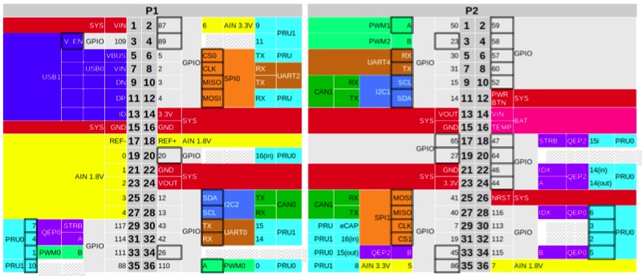

A interface CAN0 pode ser ligado nos pino 26 e 28 do conector P1. Nota-se que a interface CAN1 pode ser ligado nos pinos 9,10 ou 25,27. 

| Beagle  | pino | transciever |  pino |
|:-------:|:----:|:-----------:|:-----:|
| gnd     | 21   | GND         | 2     |
| 3.3v    | 23   | 3V3         | 1     | 
| can1 rx | 25   | CRX         | 4     |
| can1 tx | 27   | CTX         | 3     |


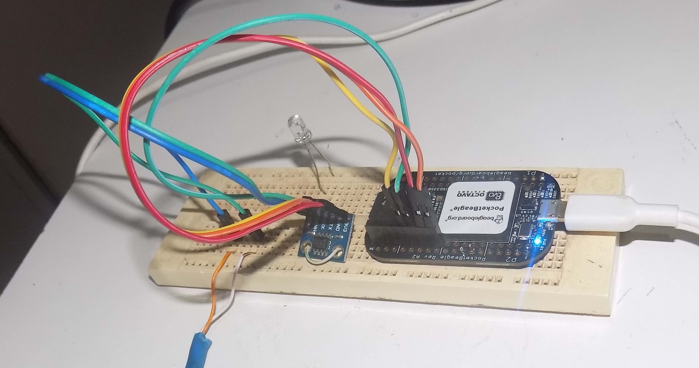

Há um programa de configuração de pinos que permite escolher a funcionalidade do pino e ver seu atual uso.
Por exemplo o seguinte comando lista todas as opções disponíveis para o pino P2.5:
 
`config-pin -l P2.25`

```
Available modes for P2_25 are: default gpio gpio_pu gpio_pd gpio_input spi spi_cs uart can i2c
``` 

Para configurar o pino para acessar a interface can:

`config-pin P2.27 can`

Para finalizar o processe de configuração do hardware temos que iniciar a interface CAN com o seguinte comando: 

` sudo /sbin/ip link set can1 up type can bitrate 500000`

Com isso pode se verificar o status da interface can com os comandos normais de rede do linux que deve mostrar a nova interface can e todos os outros interfaces de comunicação do sistema.

`ifconfig`

Para automatizar o processo de ativação do Can bus no boot ainda falta descobrir como configurar os pinos como interface can durante o boot.  
Pode ser depois usar a mesma sequencia de ativação do can durante o boot.

O resto do procedimento é o mesmo que foi apresentado no CAN-UTILS.


`candump can`

Há uma vasta documentação técnica sobre o uso do SocketCan em sistemas operacionais Linux acessando a porta CAN a partir de programas desenvolvido em C/C++ ou Python.


